# Sofle Miryoku visual guide

This guide shows the current `mhoangsb` layout, including all 24 added coding
keys and the VI navigation arrangement. Each image includes all 60 physical
positions. Click an image to open it at full size. Position labels such as
`L43` match the physical map in [readme.md](readme.md#3-physical-positions-and-layout-argument-order).

## Reading the diagrams

- **Purple:** tap a character; hold a modifier.
- **Green:** tap a character; hold a layer.
- **Amber:** double-tap to select a default layer or enter the bootloader.
- **Pale blue-grey:** extra key inherited from BASE or EXTRA.
- **Grey “Blocked”:** the position does nothing on that layer.
- **White:** ordinary key. Direct Ctrl, Shift, Alt, and GUI act immediately.
- **Blue in hold views:** a shifted symbol produced by Auto Shift.

Letters and punctuation assume a US host keyboard layout. GUI means
Windows/Super/Command. AltGr is Right Alt. Clipboard keys use the profile in
`config.h`; the current original Miryoku profile is not conventional Ctrl+C/V.
RGB controls are displayed but lighting support is currently disabled.
The two positions labelled `LENC` and `RENC` are your ordinary replacement
buttons; rotary encoder support is disabled.

## Getting to a layer

The following holds work from **BASE or EXTRA**. Use the named core thumb key,
not the duplicate Escape, Tab, Enter, or Backspace in an outer column.
Release the held key to return to the previous default layer.

| Layer | Hold this physical key | Tap action on BASE | Return |
| --- | --- | --- | --- |
| BASE | Starts automatically at boot | — | See default-layer selectors below |
| EXTRA | Hold `L43`, then double-tap `L13`; release `L43` | Space, then E | Select BASE with `L43` + double-tap `L14` |
| TAP | Hold `L43`, then double-tap `L12`; release `L43` | Space, then W | Reconnect USB to return to BASE |
| BUTTON | `L31` or `R34` | Z or slash | Release the held key |
| NAV | `L43` | Space | Release Space |
| MOUSE | `L44` | Tab | Release Tab |
| MEDIA | `L42` | Escape | Release Escape |
| NUM | `R42` | Backspace | Release Backspace |
| SYM | `R41` | Enter | Release Enter |
| FUN | `R43` | Delete | Release Delete |

On EXTRA, BUTTON's left hold key taps Z and its right hold key taps slash.
The thumb access keys occupy the same positions on BASE and EXTRA.

### Selecting a default layer with a double tap

A selector labelled “double tap” changes the **resting/default layer**, rather
than keeping it active only while a key is held. Exactly two taps perform the
action; one or three taps do not. Wait for the dance to finish before releasing
the layer access key. The selection lasts until another selection or a reboot.

The four selectors are available on these functional layers:

| While on | Bootloader | Select TAP | Select EXTRA | Select BASE |
| --- | --- | --- | --- | --- |
| NAV, MOUSE, MEDIA | `L11` | `L12` | `L13` | `L14` |
| NUM, SYM, FUN | `R14` | `R13` | `R12` | `R11` |

For example: **hold left Space → double-tap `L13` → release Space** selects
Colemak DH EXTRA. Use **hold left Space → double-tap `L14` → release Space**
to select QWERTY BASE again.

Other double-tap selectors choose functional layers:

| While on | Double-tap position | Selected default layer |
| --- | --- | --- |
| NAV or NUM | `L33` on NAV / `R31` on NUM | NUM |
| NAV or NUM | `L34` on NAV / `R32` on NUM | NAV |
| MOUSE or SYM | `L33` on MOUSE / `R31` on SYM | SYM |
| MOUSE or SYM | `L34` on MOUSE / `R32` on SYM | MOUSE |
| MEDIA or FUN | `L33` on MEDIA / `R31` on FUN | FUN |
| MEDIA or FUN | `L34` on MEDIA / `R32` on FUN | MEDIA |

These functional layers have their own BASE selectors for returning. TAP has
no layer selectors or layer holds: reconnect USB to leave it. Bootloader
selection enters flashing mode. Every normal firmware boot starts on BASE.

## BASE — QWERTY

**Access:** power on/reconnect, or double-tap the BASE selector from a functional
layer. Tap view shows normal characters and the added coding keys.

[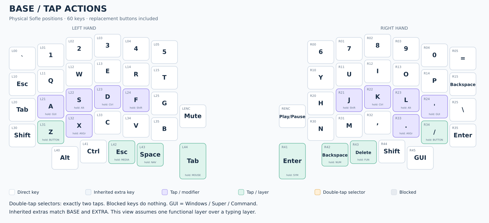](visuals/base-tap.png)

**Hold:** home-row keys become modifiers; Z/slash open BUTTON; the six core
thumbs open MEDIA, NAV, MOUSE, SYM, NUM, and FUN. The hold view shows Auto Shift
symbols for eligible number/punctuation keys held without other modifiers.

[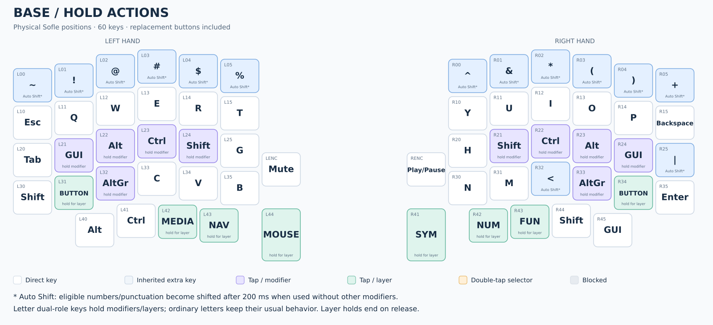](visuals/base-hold.png)

For example, hold F (`L24`) and tap a letter for a capital. Hold the core Space
thumb (`L43`) and press H/J/K/L for VI-position arrow keys on NAV.

## EXTRA — Colemak DH

**Access:** from BASE, hold Space (`L43`), double-tap `L13`, then release Space.
The added coding keys and physical hold assignments match BASE.

[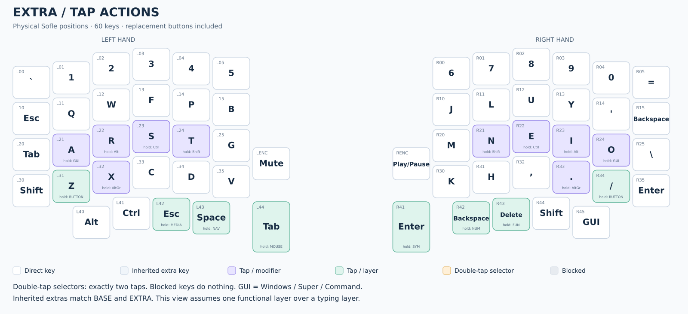](visuals/extra-tap.png)

**Hold:** T (`L24`) and N (`R21`) are Shift. The layer holds and other modifiers
occupy the same physical positions as BASE, even though the letters differ.

[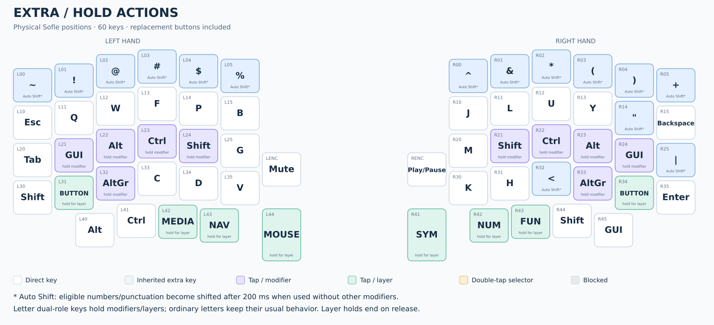](visuals/extra-hold.png)

**Return:** hold Space (`L43`), double-tap `L14`, then release Space.

## TAP — plain QWERTY

**Access:** from BASE/EXTRA, hold Space (`L43`), double-tap `L12`, then release Space.

[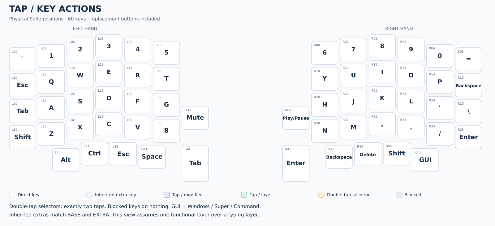](visuals/tap.png)

**Tap/hold:** letter and core thumb keys have no alternate modifier/layer holds.
The direct extra modifiers still work, and eligible numbers/punctuation still
use Auto Shift after 200 ms. There is no layer access or BASE selector here.

**Return:** reconnect USB to restart on BASE.

## BUTTON — mouse buttons and clipboard

**Access:** hold Z (`L31`) or slash (`R34`) from BASE/EXTRA.

[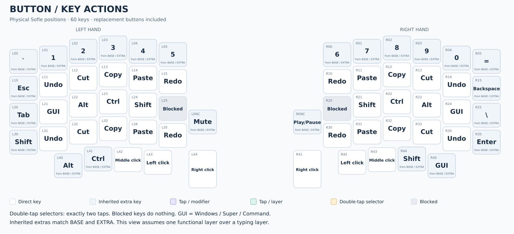](visuals/button.png)

**Tap/hold:** ordinary modifiers remain active while held; mouse buttons remain
pressed while held, allowing dragging. Clipboard actions use the selected
clipboard profile. There are no default-layer selectors on BUTTON.

**Return:** release Z or slash.

## NAV — VI navigation

**Access:** hold the core left Space thumb (`L43`).

[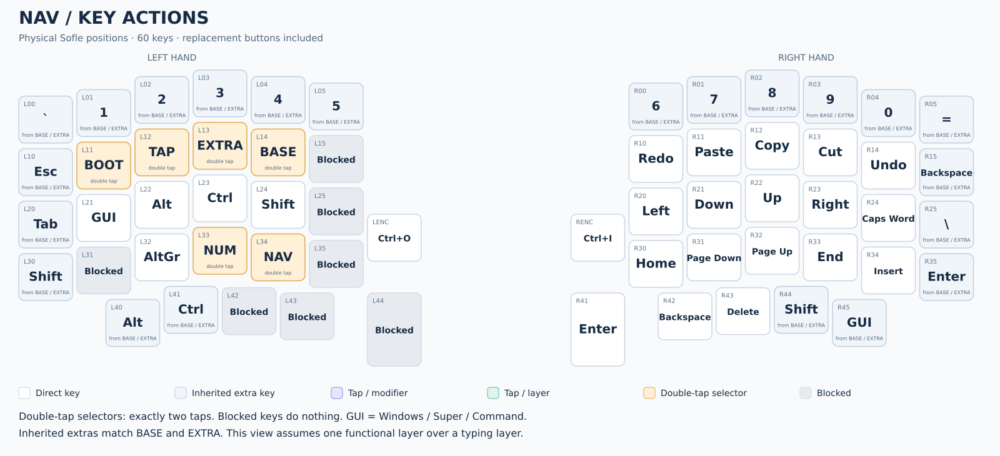](visuals/nav.png)

H/J/K/L positions send Left/Down/Up/Right. Caps Word is at `R24`, the BASE
apostrophe position; Shift + this key sends Caps Lock. Home/Page Down/Page Up/End/
Insert occupy the row below. The extra buttons send Ctrl+O and Ctrl+I for older/
newer jumps in Neovim Normal mode with default mappings.

**Tap/hold:** navigation keys use ordinary key behavior; selectors require two
taps. Extra modifiers and editing keys remain available.

**Return:** release Space. If NAV was selected as the default layer, double-tap
BASE at `L14` instead.

## MOUSE — pointer and wheel

**Access:** hold the core left Tab thumb (`L44`).

[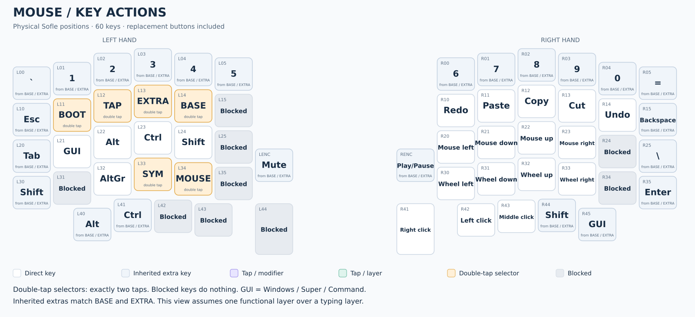](visuals/mouse.png)

**Tap/hold:** hold a movement key for continuous pointer or wheel movement.
Thumb buttons are right/left/middle click; hold one to drag. The two extra
buttons inherit Mute and Play/Pause.

**Return:** release Tab. If MOUSE is the default layer, double-tap BASE at `L14`.

## MEDIA — audio and lighting controls

**Access:** hold the core left Escape thumb (`L42`).

[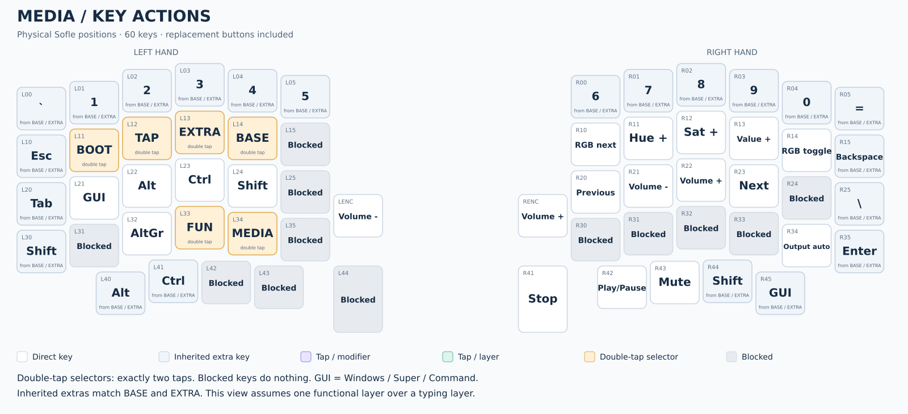](visuals/media.png)

The replacement buttons send Volume Down/Up on this layer. Core thumbs are
Stop, Play/Pause, and Mute. RGB controls require enabled lighting hardware.
Output auto has no Bluetooth route to select on this wired Sofle.

**Tap/hold:** ordinary media key behavior; double-tap selectors change the
default layer. The extra modifiers remain immediately available.

**Return:** release Escape. If MEDIA is the default layer, double-tap BASE at `L14`.

## NUM — numbers and punctuation

**Access:** hold the core right Backspace thumb (`R42`).

[](visuals/num.png)

**Tap/hold:** the numeric cluster sends top-row digits, not keypad digits.
Holding an eligible number/punctuation key without another modifier triggers
Auto Shift after 200 ms. The added physical number row also remains available.

**Return:** release Backspace. If NUM is the default layer, double-tap BASE at `R11`.

## SYM — coding symbols

**Access:** hold the core right Enter thumb (`R41`).

[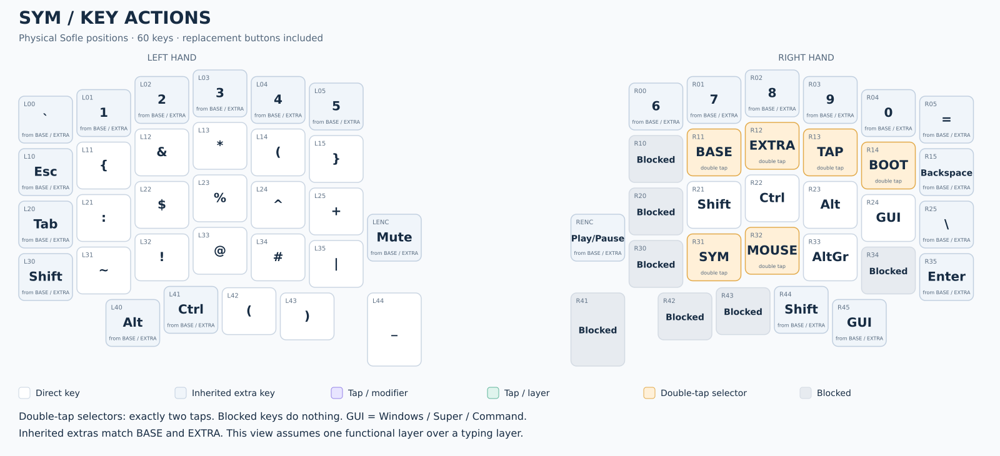](visuals/sym.png)

**Tap/hold:** the displayed symbols are already shifted keycodes; tap them
directly. Direct Shift/Ctrl/Alt/GUI keys remain available for combinations.

**Return:** release Enter. If SYM is the default layer, double-tap BASE at `R11`.

## FUN — function and system keys

**Access:** hold the core right Delete thumb (`R43`).

[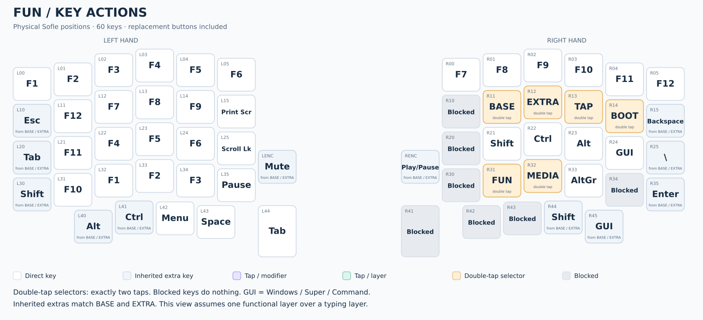](visuals/fun.png)

The added number row sends F1–F12 left to right. The original function-key
cluster is also available, together with Print Screen, Scroll Lock, and Pause.

**Tap/hold:** ordinary function keys and direct modifiers. Default-layer
selectors still require exactly two taps.

**Return:** release Delete. If FUN is the default layer, double-tap BASE at `R11`.

## Keeping the images current

The images are generated from `keymap.c` and the Sofle rev1 physical layout.
After editing assignments, regenerate them from the QMK root:

```sh
python3 keyboards/sofle/keymaps/mhoangsb/visuals/generate.py
```

The generator needs Python 3 and `rsvg-convert`. It produces PNG images for
Markdown and matching editable SVG files. Functional diagrams resolve
transparent extras using BASE; these extra assignments are currently identical
on EXTRA and TAP. If that changes, generate separate context views. The written
access instructions should also be reviewed after changing layer-tap or
Tap Dance assignments. Stacked functional layers may resolve transparent keys
differently from the single-functional-layer views shown here.
